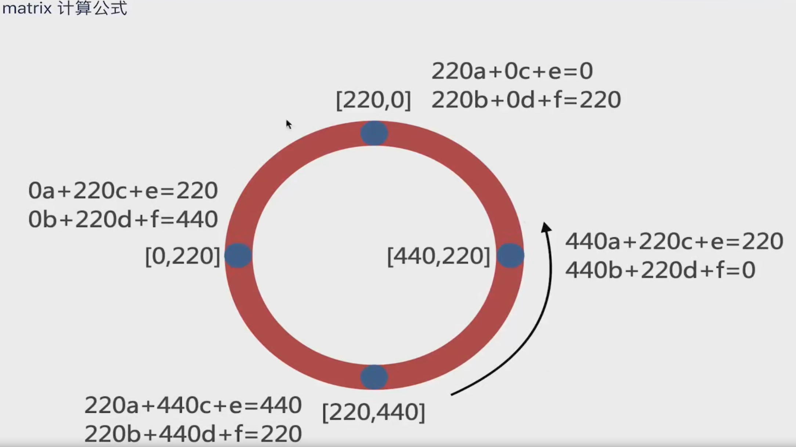

# svg-demo
## svg
- svg + css - 环形进度条

- svg + css - 描边动画
- svg SMIL动画
1. 实现过渡动画
2. 实现补间动画
3. 动画颜色变换
4. 路径运动动画（CSS3无法实现）- animateMotion标签
- svg loading动画
- svg 容器飞线动画 + 自适应容器

> 实现细节：
> - rotate: auto -> 0 可以更加流畅
> - begin: 可填入多个值，支持表达式
> - 多个 animateMotion 并行时，后者会覆盖前者
> - path 用法：[查看](https://www.w3school.com.cn/svg/svg_path.asp)

## CSS3动画
- 小球跟随过渡动画 - transition + transform
